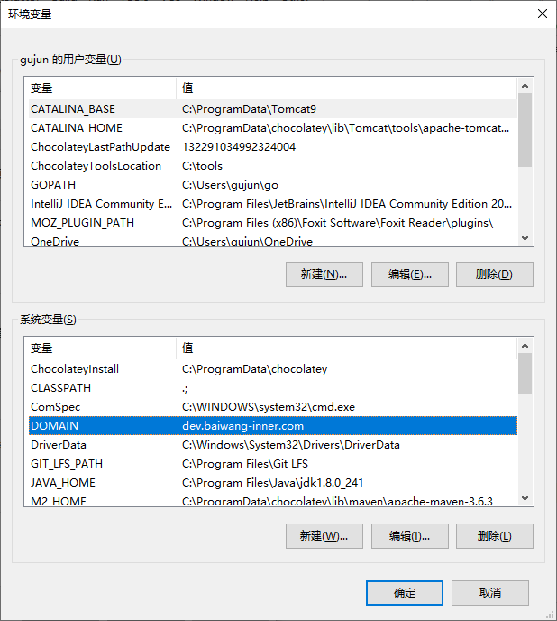
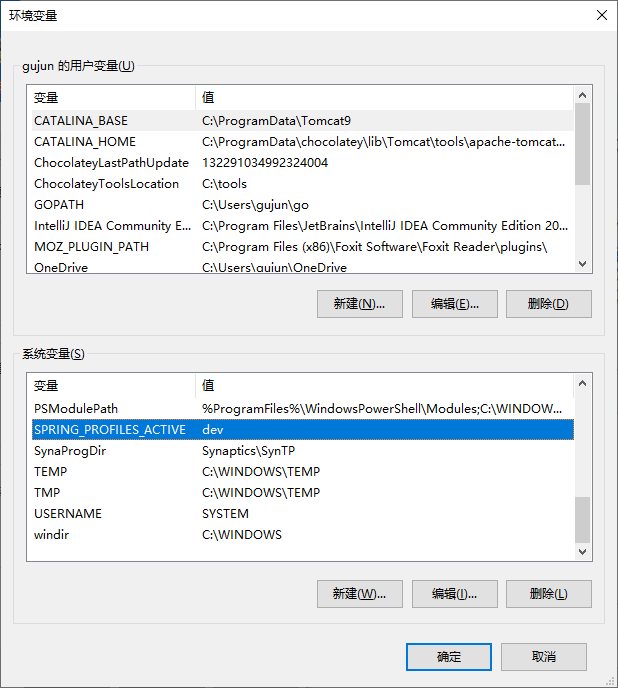

### 1 主键生成策略
系统默认基础了分布式全局主键策略。无需特殊的配置。如果不想使用默认的全局生成主键策略，
可以使用一下代码屏蔽。
```xml
myself:
    id: false
```

### 2 环境变量配置

| 环境变量名 | 环境变量值 |
|---|---|
| DOMAIN | dev.baiwang-inner.com |
| SPRING_PROFILES_ACTIVE | dev |

#### 1. linux/mac环境下

```bash
vim ~/.bash_profile
# 在~/.bash_profile里最后一行增加
export DOMAIN=dev.baiwang-inner.com
export SPRING_PROFILES_ACTIVE=dev
# 保存后刷新环境变量
source ~/.bash_profile
```

#### 2. windows环境下

直接增加环境变量就ok了

| 环境变量名 | 环境变量值 |
|---|---|
| DOMAIN | dev.baiwang-inner.com |
| SPRING_PROFILES_ACTIVE | dev |




